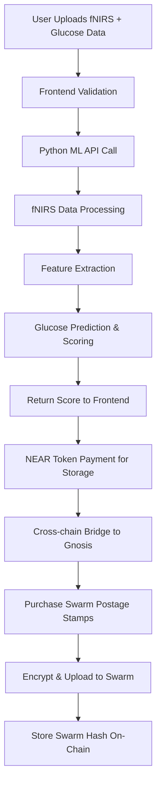

# Design Document

## Overview

This design outlines the integration of a real Python-based machine learning pipeline to replace the current Genkit AI mock in the agentic_health application. The system will process fNIRS (functional Near-Infrared Spectroscopy) data paired with glucose readings to generate contribution scores, while enabling NEAR token payments for Swarm storage. This represents the first phase toward building a verifiable AI platform for decentralized science.

The design maintains the existing NEAR Protocol and Swarm architecture while introducing a Python ML backend and cross-chain payment mechanisms for storage.

## Architecture

### High-Level System Flow



### Component Architecture

The system consists of four main layers:

1. **Frontend Layer** (Next.js/React)
   - Data upload interface
   - NEAR wallet integration
   - Swarm storage UI
   - Progress tracking and user feedback

2. **Python ML Backend** (FastAPI)
   - fNIRS data preprocessing
   - Feature extraction pipeline
   - Glucose prediction models
   - Shapley-based contribution scoring

3. **Blockchain Layer** (NEAR Protocol)
   - Smart contracts for staking and payments
   - Cross-chain bridge integration
   - Transaction verification

4. **Storage Layer** (Swarm Network)
   - Decentralized file storage
   - Encryption and access control
   - Postage stamp management

## Components and Interfaces

### 1. Python ML Pipeline Service

**Location**: `agent_logic/ml_pipeline.py`

**Responsibilities**:
- Process raw fNIRS optical signals
- Convert to dHbO/dHbR measurements
- Extract statistical features from data epochs
- Train/use regression models for glucose prediction
- Calculate contribution scores using Shapley values

**API Interface**:
```python
@app.post("/api/score-contribution")
async def score_contribution(request: ScoreContributionRequest) -> ScoreContributionResponse:
    """
    Processes fNIRS and glucose data to generate contribution score
    """
```

**Input Schema**:
```python
class ScoreContributionRequest(BaseModel):
    fnirs_data: str  # Raw CSV/text content
    glucose_level: float  # mg/dL
    user_id: str  # NEAR account ID
```

**Output Schema**:
```python
class ScoreContributionResponse(BaseModel):
    contribution_score: int  # 0-100
    reward_points: int  # Intention points earned
    reason: str  # Explanation of score
    processing_time: float  # Seconds
    data_quality_metrics: Dict[str, float]
```

### 2. fNIRS Data Processing Module

**Core Functions**:

```python
def preprocess_fnirs_data(raw_data: str) -> ProcessedData:
    """
    Converts raw optical signals to hemoglobin measurements
    - Parse CSV/text input
    - Apply noise filtering
    - Convert to dHbO/dHbR signals
    - Validate data quality
    """

def extract_features(processed_data: ProcessedData, epoch_length: int = 30) -> FeatureVector:
    """
    Segments data into epochs and extracts statistical features
    - Mean, variance, slope for each epoch
    - Signal-to-noise ratio calculations
    - Temporal correlation features
    """

def predict_glucose(features: FeatureVector) -> GlucosePrediction:
    """
    Uses regression models to predict glucose from fNIRS features
    - Multiple model ensemble (Random Forest, SVR, Neural Network)
    - Confidence interval estimation
    - Prediction uncertainty quantification
    """
```

### 3. Shapley Value Scoring Engine

**Implementation**: `agent_logic/shapley_scorer.py`

```python
def calculate_shapley_score(
    fnirs_data: str, 
    glucose_level: float,
    historical_data: List[DataPoint]
) -> ShapleyScore:
    """
    Calculates marginal contribution using Shapley values
    - Data quality assessment (60% weight)
    - Glucose plausibility (40% weight)
    - Comparison with historical contributions
    """
```

**Scoring Criteria**:
- **Data Length**: >500 lines = 20pts, 200-500 = 10pts, <200 = 5pts
- **Signal Quality**: Noise detection and outlier analysis (-20pts max)
- **Format Validation**: CSV structure and completeness (-20pts max)
- **Glucose Range**: Optimal 90-110 mg/dL (20pts), decreasing for outliers
- **Correlation Analysis**: Fictional correlation between fNIRS variability and glucose (20pts)

### 4. NEAR Token Payment Integration

**Smart Contract Extension**: `contracts/staking_contract/src/lib.rs`

```rust
pub fn initiate_storage_payment(&mut self, amount: U128, swarm_address: String) -> Promise {
    // Validate user has sufficient staked tokens
    // Create cross-chain payment transaction
    // Lock tokens during bridge process
}

pub fn confirm_storage_payment(&mut self, tx_hash: String, user_id: AccountId) {
    // Verify cross-chain transaction completion
    // Update user storage allowance
    // Emit payment confirmation event
}
```

### 5. Cross-Chain Bridge Integration

**Service**: `agent_logic/bridge_service.py`

```python
class NearToGnosisBridge:
    def initiate_transfer(self, near_amount: float, gnosis_address: str) -> BridgeTransaction:
        """
        Initiates NEAR to xDAI/xBZZ transfer
        - Validate bridge availability
        - Calculate fees and exchange rates
        - Submit bridge transaction
        """
    
    def monitor_transfer(self, bridge_tx_id: str) -> TransferStatus:
        """
        Monitors cross-chain transfer progress
        - Check bridge confirmation status
        - Handle transfer failures
        - Update user on progress
        """
```

### 6. Swarm Storage Integration

**Enhanced Service**: `src/lib/swarm-client.ts`

```typescript
class SwarmStorageClient {
  async purchasePostageStamps(gnosisAddress: string, amount: number): Promise<StampBatch> {
    // Use bridged tokens to purchase stamps
    // Validate stamp batch creation
    // Return stamp batch ID for uploads
  }

  async uploadEncryptedData(
    data: ArrayBuffer, 
    stampBatch: string,
    encryptionKey: string
  ): Promise<SwarmHash> {
    // Encrypt data client-side
    // Upload to Swarm network
    // Return content hash
  }
}
```

## Data Models

### Core Data Structures

```python
@dataclass
class FNIRSDataPoint:
    timestamp: float
    wavelength_760nm: float
    wavelength_850nm: float
    dHbO: Optional[float] = None  # Calculated
    dHbR: Optional[float] = None  # Calculated

@dataclass
class ProcessedFNIRSData:
    data_points: List[FNIRSDataPoint]
    sampling_rate: float
    duration_seconds: float
    quality_score: float
    noise_level: float

@dataclass
class FeatureVector:
    epoch_features: List[EpochFeatures]
    global_features: GlobalFeatures
    metadata: DataMetadata

@dataclass
class EpochFeatures:
    mean_dHbO: float
    var_dHbO: float
    slope_dHbO: float
    mean_dHbR: float
    var_dHbR: float
    slope_dHbR: float
    signal_to_noise: float

@dataclass
class ContributionRecord:
    user_id: str
    timestamp: datetime
    fnirs_hash: str  # Swarm content hash
    glucose_level: float
    contribution_score: int
    reward_points: int
    swarm_storage_cost: float
    processing_metrics: Dict[str, Any]
```

### Database Schema (Local Storage)

```sql
-- User contributions tracking
CREATE TABLE contributions (
    id SERIAL PRIMARY KEY,
    user_id VARCHAR(64) NOT NULL,
    created_at TIMESTAMP DEFAULT NOW(),
    fnirs_swarm_hash VARCHAR(128),
    glucose_level FLOAT,
    contribution_score INTEGER,
    reward_points INTEGER,
    processing_time_ms INTEGER,
    data_quality_score FLOAT
);

-- Model performance tracking
CREATE TABLE model_metrics (
    id SERIAL PRIMARY KEY,
    model_version VARCHAR(32),
    mae FLOAT,  -- Mean Absolute Error
    rmse FLOAT, -- Root Mean Square Error
    r2_score FLOAT,
    training_samples INTEGER,
    updated_at TIMESTAMP DEFAULT NOW()
);
```

## Error Handling

### Error Categories and Responses

1. **Data Validation Errors**
   - Invalid file format
   - Insufficient data length
   - Corrupted or malformed data
   - Response: HTTP 400 with specific validation message

2. **Processing Errors**
   - ML pipeline failures
   - Feature extraction errors
   - Model prediction failures
   - Response: HTTP 500 with error tracking ID

3. **Payment Errors**
   - Insufficient NEAR tokens
   - Bridge transaction failures
   - Swarm stamp purchase failures
   - Response: HTTP 402 with payment retry options

4. **Storage Errors**
   - Swarm network unavailability
   - Encryption failures
   - Upload timeouts
   - Response: HTTP 503 with retry mechanisms

### Error Recovery Strategies

```python
class ErrorHandler:
    def handle_processing_error(self, error: Exception, data: InputData) -> ErrorResponse:
        # Log error with context
        # Attempt data repair if possible
        # Provide user-friendly error message
        # Suggest corrective actions
        
    def handle_payment_error(self, error: PaymentError, user_id: str) -> PaymentRetry:
        # Check user token balance
        # Verify bridge status
        # Offer alternative payment methods
        # Schedule automatic retry
```

## Testing Strategy

### Unit Testing

1. **ML Pipeline Tests**
   ```python
   def test_fnirs_preprocessing():
       # Test data parsing and validation
       # Test noise filtering algorithms
       # Test dHbO/dHbR conversion accuracy
   
   def test_feature_extraction():
       # Test epoch segmentation
       # Test statistical feature calculations
       # Test feature vector consistency
   
   def test_glucose_prediction():
       # Test model prediction accuracy
       # Test confidence interval calculation
       # Test edge case handling
   ```

2. **Scoring Algorithm Tests**
   ```python
   def test_shapley_scoring():
       # Test deterministic scoring
       # Test score consistency
       # Test edge cases (empty data, extreme values)
   ```

3. **Integration Tests**
   ```python
   def test_end_to_end_scoring():
       # Test complete pipeline from upload to score
       # Test error handling at each stage
       # Test performance under load
   ```

### Performance Testing

- **Throughput**: Target 10 concurrent scoring requests
- **Latency**: <30 seconds for typical fNIRS files
- **Memory**: <2GB RAM usage per request
- **Storage**: Efficient cleanup of temporary files

### Security Testing

- **Input Validation**: SQL injection, XSS prevention
- **Data Encryption**: Verify client-side encryption
- **Access Control**: NEAR wallet authentication
- **Bridge Security**: Cross-chain transaction validation

## Implementation Phases

### Phase 1: Core ML Pipeline (Week 1-2)
- Implement fNIRS data preprocessing
- Create feature extraction pipeline
- Build basic glucose prediction model
- Integrate Shapley scoring algorithm

### Phase 2: API Integration (Week 3)
- Replace Genkit AI calls with Python API
- Update frontend error handling
- Implement progress tracking
- Add comprehensive logging

### Phase 3: Payment Integration (Week 4)
- Implement NEAR token bridge integration
- Add Swarm postage stamp purchasing
- Update smart contract for payments
- Test cross-chain transactions

### Phase 4: Storage Integration (Week 5)
- Complete Swarm upload functionality
- Implement client-side encryption
- Add storage cost calculation
- Test end-to-end data flow

### Phase 5: Testing & Optimization (Week 6)
- Performance optimization
- Security audit
- Load testing
- Documentation completion